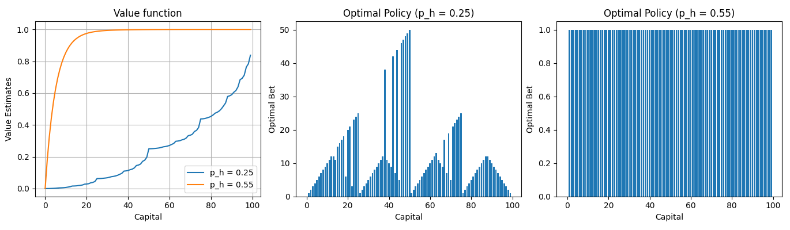

# 🎲 Gambler's Problem — Value Iteration Implementation  
**Exercise 4.9 from *Reinforcement Learning: An Introduction* (Sutton & Barto, 2nd ed.)**


---

## 🎯 Goal

Implement **Value Iteration** to solve the *Gambler’s Problem*:  
A gambler aims to reach **$100** capital by betting on biased coin flips.  
At each step, they choose how much to stake — but if they reach **$0**, they lose.

We compute:
- ✅ The **optimal value function** \( V^*(s) \): probability of winning from capital \( s \)
- ✅ The **optimal policy** \( \pi^*(s) \): how much to bet at each capital level

For two win probabilities:
- `p_h = 0.25` (unfavorable odds)
- `p_h = 0.55` (favorable odds)

---

## 🧠 Problem Summary (Sutton & Barto, Ch. 4)

| Feature           | Description |
|-------------------|-------------|
| **States**        | Capital \( s = 0, 1, 2, ..., 100 \) |
| **Terminal States** | \( s = 0 \) (lose), \( s = 100 \) (win) |
| **Actions**       | Bet \( a \in \{1, 2, ..., \min(s, 100-s)\} \) |
| **Dynamics**      | With prob. \( p_h \): go to \( s+a \); with prob. \( 1-p_h \): go to \( s-a \) |
| **Reward**        | +1 only upon reaching \( s = 100 \); 0 otherwise |
| **Discount**      | \( \gamma = 1 \) (episodic, undiscounted) |
| **Objective**     | Maximize probability of reaching $100 |

> 🔍 Because rewards are sparse and only terminal, \( V(s) \) directly equals the *win probability* from state \( s \).

---

## 📦 Requirements

```bash
pip install numpy matplotlib
```

- Python ≥ 3.8
- No external RL libraries needed — pure implementation from first principles.

---

## ▶️ How to Run

1. Clone or download the repo.
2. Run the script:

```bash
python gambler_value_iteration.py
```

3. Two figures will appear:
   - **Bottom-left**: Value functions \( V(s) \) for `p_h=0.25` and `p_h=0.55`
   - **Bottom-center**: Optimal bet policy for `p_h=0.25`
   - **Bottom-right**: Optimal bet policy for `p_h=0.55`

✅ No command-line arguments needed — hardcoded per exercise specs.

---

## 📊 Sample Output

<p align="center">
  
</p>

### Key Observations:
- When `p_h = 0.25` (disadvantageous), optimal policy is often **bold**: bet *as much as possible* (all-or-nothing).
- When `p_h = 0.55` (advantageous), optimal policy is often **timid**: bet *minimum needed* (e.g., \$1) to reduce variance.
- The value function is highly **nonlinear** and **discontinuous** in policy — a hallmark of this problem!

---

## 🧩 Code Structure

```python
value_iteration_gambler(p_h, theta=1e-9, goal=100)
```

- Implements **synchronous value iteration**.
- Uses **greedy policy improvement** after convergence.
- Returns:
  - `V`: optimal value estimates (length 101)
  - `policy`: optimal bet amount for each capital (0–100)
---

## 📚 References

- Sutton, R. S., & Barto, A. G. (2018). *Reinforcement Learning: An Introduction* (2nd ed.), **Chapter 4**, Exercise 4.9.  
  🔗 http://incompleteideas.net/book/RLbook2020.pdf
- Figure 4.3 & 4.6 in the textbook illustrate expected results.

---
